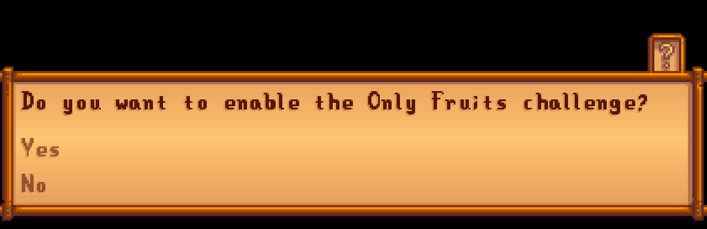
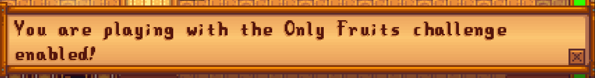

# Only Fruits
A Stardew Valley mod which enforces the ruleset of CozyAndCaffeinated's OnlyFruits challenge run. 

## Background Information
The "Only Fruits" challenge run was created by CozyAndCaffeinated.  Please go support her!
- https://linktr.ee/CozyandCaffeinated
- https://www.youtube.com/@cozyandcaffeinated

You can find a youtube playlist of the series here: https://www.youtube.com/watch?v=udju_3aAqQw&list=PLHZ9MvcxjqCXWM-FMpDtWZ9UUWY7U9x8A

She came up with the challenge, all I've done is convert the ruleset into a mod.  I have NO affiliation with her, I am just a fan of their work.  Any views, phrasing, comments, statements, or opinions expressed within this mod are those of the individual who wrote them, and do not necessarily reflect the official policy, position, or opinions of CozyAndCaffeinated.

## What this mod does
This mod makes a few changes to the way the game works.
### Sale Price
This mod sets the sell price (i.e. the amount that a player gets if they try to sell an item) of ALL items (except the following) to 0:
- Fruits (https://stardewvalleywiki.com/Fruits)
- Cooking recipes that use a fruit as an ingredient (except the following):
  - Summer Seeds
  - Fall Seeds
  - Winter Seeds
  - Warp Totem: Desert
- The following artisinal goods:
  - Jelly
  - Wine
  - Raisins
  - Dried Fruit
- Some meme items that Lavender's community decided along the way
  - ch- ch- ch- ch- Cherry Bombs!
- Some stuff we figured should've been considered fruit:
  - Sweet Gem Berries
### Quest Rewards
Since one of the purposes of the challenge is to make money Only using Fruits, quests that reward money via non-fruits have their money/gem rewards dropped down to 0.

For a few of the vanilla quests that have requirements that can either be a fruit or a non-fruit, this mod removes the non-fruit choices.
- Lewis's [Crop Order quest](https://stardewvalleywiki.com/Quests#Crop_Order) now has the following possible requirements:
  - Spring: Strawberry
  - Summer: Blueberry, Melon, Hot Pepper
  - Fall:   Cranberries, Grape
- Caroline's [Island Ingredients quest](https://stardewvalleywiki.com/Quests#Island_Ingredients) now has the following possible requirements:
  - Pineapple

#### Daily Quests
Non-fruit daily quests will have their monetary rewards set to 0. The reward will be restored if the challenge is disabled.

### Trash Can Behavior
Because not every item has a changeable sell price (e.g. trinkets, boots, weapons), the upgraded trash cans can be used to get money from them. I've disabled the upgraded trash cans, and if a save is loaded with an upgraded trash can, your trash can will be downgraded to the basic one that doesnt give any monies upon trashing! 
If you later disable the mod, then your original trash can level will be restored (i.e. if you had a gold trash can before enabling the mod, you will have a gold trash can once it is disabled)

## Configuring the mod
Many of these changes are configurable.  By default, every restriction is enabled.  But there is a mod UI available which allows enabling/disabling the various parts of the mod.

Once this mod is installed:
- If an existing save is opened for the first time, you will be asked if you want to enable the challenge.  
  - if you select "yes", then the effects of the mod will be applied.
  
  - if you select "no", then the effects will NOT be applied. Once you save that file, you wont be asked again.
  
- If a new file is created, you will be asked if you want to enable the challenge.
  - if you select "yes", then the effects of the mod will be applied.
  - if you select "no", then the effects will NOT be applied. Once you save that file, you wont be asked again.
Every time you play a save that has the mod enabled, you will be notified that the mod is enabled!


## Installing the mod
**IMPORTANT**: Please make sure you have made a backup of your worlds before trying this mod: [Instructions](https://www.stardewvalleywiki.com/Saves#Find_your_save_files)

Before you can use this mod, please follow the [instructions here](https://stardewvalleywiki.com/Modding:Player_Guide/Getting_Started)

You'll need to do the following steps:
- install SMAPI (NOTE: I compiled the mod using v4.5.2)
- add [GenericModConfigMenu](https://www.nexusmods.com/stardewvalley/mods/5098) to your `Mods/` folder

Once those steps are done, you'll need to:
- download the latest version of this mod from the [releases](https://github.com/RoseBunnyPuppy/OnlyFruits/releases) page.
- extract the zip, and move the `OnlyFruitsMod` folder into your `Mods/` folder


## For Developers
### Preparation
Please ensure you have the following installed:
- Stardew Valley
- SMAPI
- .NET 6 SDK
- an IDE (I've only tested on windows using Visual Studio)

You can follow the instructions here: https://www.stardewvalleywiki.com/Modding:Modder_Guide/Get_Started#Requirements

### Download the repo
Download this repo, and open it in your IDE (I'm assuming you are using Visual Studio)

### Do any extra configuration for a non-standard game location
This section only applies to thos who have Stardew Valley installed in a non-standard location (see: https://github.com/Pathoschild/SMAPI/blob/develop/docs/technical/mod-package.md#custom-game-path).
If you have Stardew Valley installed in a "non-standard location", create a copy of the `_stardewtargets/example.stardewvalley.targets` file, and name it so that it follows the pattern `SOME_NAME.stardewvalley.targets`.  For me, I use `rose.stardewvalley.targets`.  The gitignore is configured to ignore files named `*.stardewvalley.targets`, and the csproj file is configured to auto-import any files named `*.stardewvalley.targets`.
Within your copy, follow the instructions within the file!
On windows, here is an example file for my non-standard installation:
```
<Project>
	<PropertyGroup>
		<GamePath>G:/SteamLibrary/steamapps/common/Stardew Valley</GamePath>
	</PropertyGroup>
</Project>
```
Once you have the path specified, try to rebuild the project (you might need to restart your IDE).

### Download the requirement mods
Download the `GenericModConfigMenu` mod from here https://www.nexusmods.com/stardewvalley/mods/5098
Extract it to your Mods folder (Follow the instructions on the nexusmods page).

### Build and run
Once everything is configured, you should be able to "run" the project within your IDE, and it should work.
